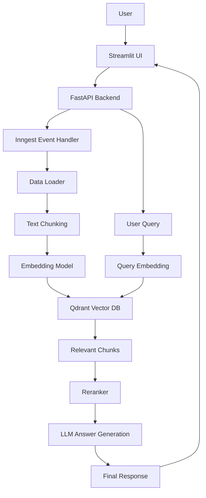

# 🚀 RAG Production App (Retrieval-Augmented Generation)

## 📌 Overview

This project is a **production-ready RAG (Retrieval-Augmented Generation) system** designed to enable intelligent question answering over PDF documents.

It integrates:

* 📄 PDF ingestion & chunking
* 🔍 Semantic search using embeddings
* 🧠 LLM-based answer generation
* ⚡ FastAPI backend
* 🗂 Qdrant vector database (Dockerized)
* 🔁 Reranking for improved retrieval accuracy
* 🔄 Event-driven workflows using Inngest
* 🎨 Interactive UI using Streamlit

---
## 🧱 Architecture Diagram
## 🧱 Architecture Diagram



```


## 🧠 System Architecture

```
User → Streamlit UI → FastAPI → Inngest → RAG Pipeline
                                 ↓
                         Qdrant Vector DB
                                 ↓
                              LLM
                                 ↓
                             Response
```

---

## ⚙️ Tech Stack

* **Backend:** FastAPI
* **Vector Database:** Qdrant (Docker)
* **Event Processing:** Inngest
* **Frontend:** Streamlit
* **Language:** Python
* **Testing:** Pytest

---

## 📂 Project Structure

```
.
├── main.py
├── data_loader.py
├── vector_db.py
├── reranker.py
├── streamlit_app.py
├── validators.py
├── custom_types.py
├── tests/
│   ├── test_basic.py
│   ├── test_pipeline.py
│   ├── test_rag_app.py
│   ├── test_streamlit_rag.py
│   └── test_validation.py
├── requirements.txt
└── README.md
```

---

# 🚀 How to Run the Project

## 🔹 Step 1: Clone Repository

```
git clone https://github.com/your-username/rag-production-app.git
cd rag-production-app
```

---

## 🔹 Step 2: Create Virtual Environment

```
python -m venv .venv
.venv\Scripts\activate
```

---

## 🔹 Step 3: Install Dependencies

```
pip install -r requirements.txt
```

---

## 🔹 Step 4: Setup Environment Variables

Create `.env` file:

```
OPENAI_API_KEY=your_api_key_here
```

---

# 🐳 Step 5: Run Qdrant (Docker)

```
docker run -d --name qdrantRagDb -p 6333:6333 -v ${PWD}/qdrant_storage:/qdrant/storage qdrant/qdrant
```

---

# ⚡ Step 6: Run FastAPI Backend

```
uvicorn main:app --reload
```

API runs at:

```
http://127.0.0.1:8000
```

---

# 🔄 Step 7: Start Inngest Dev Server

```
npx inngest-cli@latest dev -u http://127.0.0.1:8000/api/inngest
```

---

# 🎨 Step 8: Run Streamlit UI

```
streamlit run streamlit_app.py
```

---

## 📡 API Endpoints

### 📥 Ingest PDF

```
POST /rag-ingest
```

### ❓ Query Documents

```
POST /rag-query
```

---

# 🧪 Testing

This project includes **comprehensive functional testing** using Pytest.

### 🔍 Test Coverage Includes:

* ✅ Core pipeline testing (`test_pipeline.py`)
* ✅ RAG application logic (`test_rag_app.py`)
* ✅ API validation (`test_validation.py`)
* ✅ Basic functionality (`test_basic.py`)
* ✅ Streamlit integration (`test_streamlit_rag.py`)

### ▶️ Run Tests

```
pytest
```

---

# 🔥 Features

* 📄 PDF ingestion & chunking
* 🔍 Semantic search with embeddings
* 🧠 Context-aware AI responses
* 🔁 Reranking for better accuracy
* ⚡ FastAPI scalable backend
* 🐳 Dockerized Qdrant database
* 🔄 Event-driven processing (Inngest)
* 🎨 Streamlit UI for interaction
* 🧪 Functional testing suite

---

# ⚠️ Important Notes

* Do NOT commit `.env` file (contains API keys)
* Ensure Docker is running before starting Qdrant
* Ports required:

  * `8000` → FastAPI
  * `6333` → Qdrant

---

# 🛠 Future Improvements

* Authentication & user management
* Multi-document querying
* Deployment (AWS / Docker Compose)
* UI enhancements

---

# 👨‍💻 Author

Shyam 
